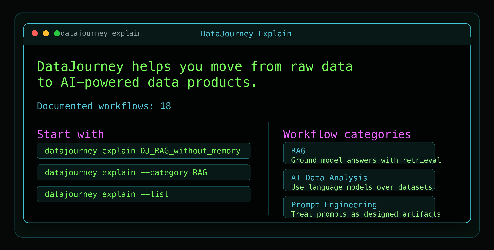
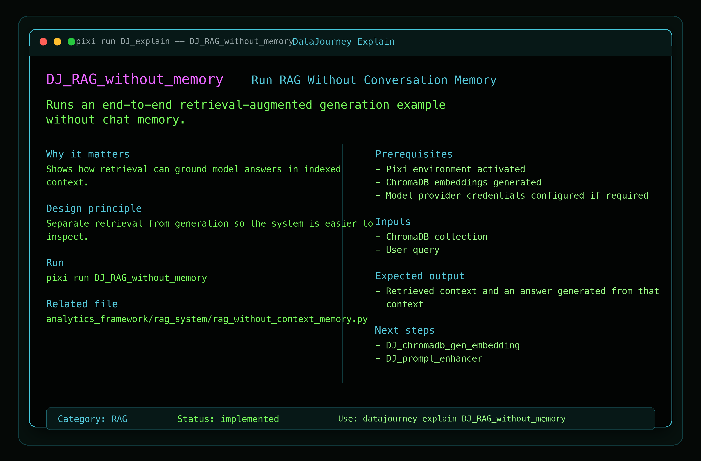
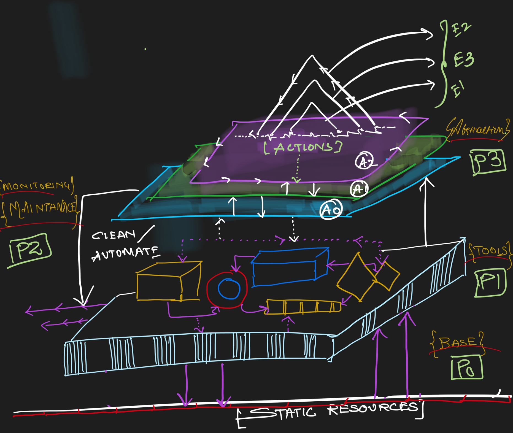

<h1 align="center">

[](https://datajourneyhq.github.io/DataJourney/)
[](https://www.apache.org/licenses/LICENSE-2.0)
[](https://www.bestpractices.dev/projects/11135)
[](https://www.contributor-covenant.org/version/2/0/code_of_conduct/)
[](https://github.com/sayantikabanik/DataJourney/actions/workflows/CI.yml)
[](https://github.com/sayantikabanik/DataJourney/actions/workflows/review.yml)

</h1>

<p align="center">
  
</p>

<p align="center">
  <b>Design AI-native data products with open-source building blocks.</b><br>
  DataJourney teaches how data, AI, retrieval, dashboards, agents, evaluation, and packaging fit together as one usable system.
</p>

<p align="center">
  <b>Recipient: GitHub Secure Open Source Fund</b><br>
  <a href="https://github.com/sponsors/DataJourneyHQ"><b>Sponsor DataJourneyHQ</b></a>
  &nbsp;|&nbsp;
  <a href="https://github.blog/open-source/maintainers/securing-the-supply-chain-at-scale-starting-with-71-important-open-source-projects/"><b>Official announcement</b></a>
</p>

## What Is DataJourney?

DataJourney is a design-first open-source toolkit for learning how to assemble AI-powered data products.

Most data and AI examples teach one tool at a time. DataJourney focuses on the system around the tool: how data is discovered, profiled, retrieved, analyzed by models, turned into an interface, evaluated, and packaged so another person can actually use it.

The project is both:

- a learning environment for understanding AI and data system design
- a practical toolkit for composing open-source workflows into runnable examples

## Start With Explain

The first user-facing layer is the DataJourney CLI. It explains what each workflow does before you run it.

<p align="center">
  
</p>

<p align="center">
  
</p>

```shell
pixi run DJ_explain
```

After installing the local package:

```shell
datajourney explain
```

Try the AI-first path:

```shell
datajourney explain DJ_RAG_without_memory
datajourney explain --category RAG
datajourney explain --list
```

The `explain` command answers the questions new users usually have:

- What does this workflow do?
- Why is it useful?
- What prerequisites do I need?
- What output should I expect?
- What should I run next?

## The Design Model

DataJourney treats a data product as a set of connected design layers.

<p align="center">
  
</p>

## Design Philosophy

DataJourney follows a LEGO-like design philosophy: small open-source capabilities should be understandable on their own, but more powerful when composed into a coherent system.

The toolkit is built with additive and subtractive layers:

- `P0 Base`: static homes and project anchors that keep the system visible, such as GitHub and documentation
- `P1 Tooling`: open-source building blocks for data, AI, retrieval, apps, and dashboards
- `P2 Maintenance`: environments, automation, quality checks, and monitoring through Pixi and GitHub Actions
- `P3 Abstraction`: user-facing layers such as the CLI, task runner, workflow metadata, and agents

Each layer should communicate clearly with the layer above it. That is the design goal: not just to run tools, but to make the system explainable, extensible, and beautiful to work with.

| Layer | Purpose | DataJourney Examples |
| --- | --- | --- |
| Source | Bring data into a visible catalog | Intake, CSV datasets, source metadata |
| Understanding | Inspect shape, schema, and meaning | profiling, EDA, dataset previews |
| Intelligence | Add AI reasoning and retrieval | LLM analysis, RAG, ChromaDB, prompt enhancement |
| Interface | Give users a surface to interact with | FastHTML, Flask, Panel dashboards, generated apps |
| Orchestration | Make workflows repeatable | Pixi, Dagster, reusable tasks |
| Evaluation | Check whether AI behavior is trustworthy | tracing and LLM evaluation examples |
| Packaging | Make the system installable and explainable | CLI, `setup.py`, workflow metadata |

The important idea: each workflow is not a random demo. It is a piece of a larger product journey.

## Quick Start

Fork or clone the repository, then enter the project:

```shell
cd DataJourney
```

Install Pixi from [prefix.dev](https://prefix.dev/), then activate the environment:

```shell
pixi shell
```

Install DataJourney locally:

```shell
pixi run DJ_package
```

Explore the toolkit:

```shell
pixi run DJ_explain
pixi run DJ_explain -- DJ_RAG_without_memory
pixi run DJ_explain -- --category RAG
pixi run DJ_list
```

For model-backed workflows, configure a `GITHUB_TOKEN` or the relevant model-provider credentials before running AI tasks.

```shell
pixi run GIT_TOKEN_CHECK
```

## AI-First Example Path

If you want to see DataJourney as an AI data-product toolkit, start here:

```shell
datajourney explain DJ_RAG_without_memory
datajourney explain DJ_prompt_enhancer
datajourney explain DJ_llm_analysis_gpt_4o
```

Then run the workflows when your credentials and prerequisites are ready:

```shell
pixi run DJ_chromadb_gen_embedding
pixi run DJ_RAG_without_memory
pixi run DJ_prompt_enhancer
```

This path shows the core design idea:

1. prepare context
2. retrieve relevant information
3. ask a model to reason over grounded data
4. turn the behavior into something explainable and reusable

## Workflow Metadata

The CLI is powered by one extensible JSON catalog:

```text
analytics_framework/workflows/workflow_catalog.json
```

Each workflow entry describes:

- summary
- benefit
- design principle
- command
- prerequisites
- expected output
- common errors
- next steps
- related files

Validate the catalog after editing it:

```shell
datajourney explain --validate
```

This makes DataJourney easier to extend because contributors can improve the user experience without changing workflow code.

## Repository Map

```text
analytics_framework/
  ai_modeling/       LLM-backed analysis examples
  build_agents/      DataJourney demo agents and agent tools
  dashboard/         Panel dashboard examples
  gpt_oss/           Prompt enhancement examples
  intake/            Cataloged datasets and web UIs
  pipeline/          Dagster pipeline example
  rag_system/        ChromaDB and RAG examples
  workflows/         CLI explanation metadata and utilities
usage_guide/         Notebook-based learning guides
assets/              Images used by docs and demos
```

## Contributing

The easiest contribution path is improving the explanation layer.

Good first contributions:

- add clearer prerequisites for a workflow
- add common errors and fixes
- improve expected output descriptions
- connect workflows with better next steps
- improve workflow categories and descriptions

Before opening a pull request, run:

```shell
datajourney explain --validate
pixi run DJ_pre_commit
```

Read [CONTRIBUTING.md](CONTRIBUTING.md), [CODE_OF_CONDUCT.md](CODE_OF_CONDUCT.md), and [SECURITY.md](SECURITY.md) before contributing.

## License

DataJourney is licensed under the [Apache License 2.0](LICENSE).
