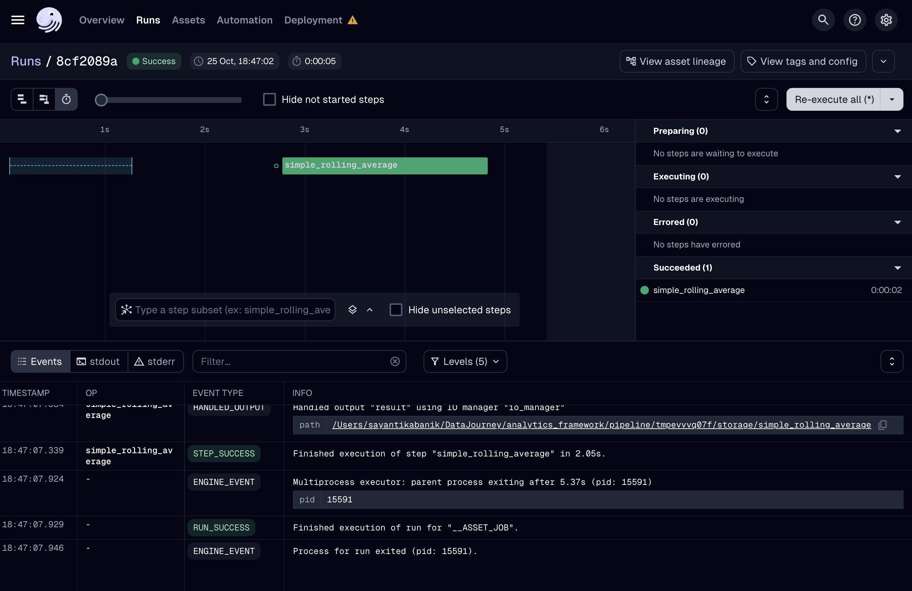
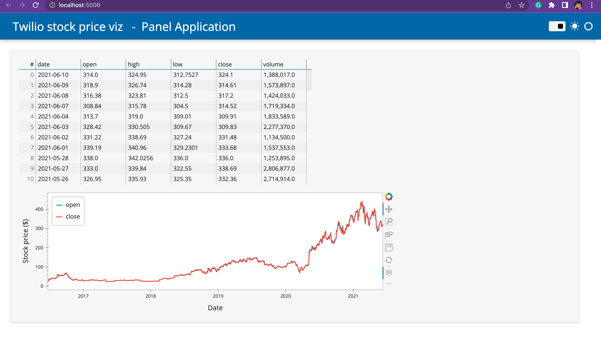

<h1 align="center">

[](https://creativecommons.org/publicdomain/zero/1.0/)
[](https://www.contributor-covenant.org/version/2/0/code_of_conduct/)\
[](https://github.com/sayantikabanik/DataJourney/actions/workflows/CI.yml)
[](https://github.com/sayantikabanik/DataJourney/actions/workflows/github-repo-stats.yml)
[](https://github.com/sayantikabanik/DataJourney/actions/workflows/static.yml)
[](https://github.com/sayantikabanik/DataJourney/actions/workflows/review.yml)
[](https://github.com/sayantikabanik/DataJourney/actions/workflows/rate-limit-monitor.yml)

</h1>

<p align="center">
  
</p>


### 🚌 DataJourney

#### 🪶Short version

Design- first Open Source Data Management Toolkit. Simplifies data workflows with modular, reproducible solutions

#### 🌲Long version

DataJourney demonstrates how organizations can effectively manage and utilize data by harnessing the power of open-source technologies. It's designed to help navigate the complex landscape of data tools, offering a structured approach to building **scalable**, and **reproducible** data workflows.

Built on open-source principles, the framework guides users through essential steps—from **identifying** goals and **selecting tools** to **testing** and **customising** workflows. With its flexible, modular design, DataJourney can be tailored to individual needs, making it an invaluable toolkit for data professionals.

### 🧱 Design Philosophy (LEGO)
Built with additive, subtractive capabilities glued with open source.
Each layer has a certain strength of communication inbuilt

- PO (Base): Static home(s) to keep it together `(GitHub)`
- P1 (Tooling): Tooling, strings `(Powered by open source)`
- P2 (Maintenance + Monitoring): Env, automations `(Pixi + GHA)`
- P3 (Abstraction): Layer(s), CLI/task manager for users to interact with `(Pixi)`


### 🛠 Current workflows covered
{✨= Experimental,
✅ = Implemented}

| Status | Workflow Description                                                                                              |
|--------|------------------------------------------------------------------------------------------------------------------|
| ✅     | `Python Packaging framework` design principles                                                                  |
| ✅     | `GitHub actions` configured                                                                                      |
| ✅     | `Vale.sh` configured at PR level                                                                                 |
| ✅     | `Pre-commit hooks` configured for code linting/formatting                                                        |
| ✨     | `Hello world` LLM design example based on [LangChain](https://python.langchain.com/)                              |
| ✅     | Environment management via [pixi](https://prefix.dev/)                                                           |
| ✅     | Reading data from online sources using [intake](https://github.com/intake/intake)                                |
| ✅     | Sample pipeline built using [Dagster](https://github.com/dagster-io/dagster)                                     |
| ✅     | Building Dashboard using [holoviews](https://holoviews.org/gallery/index.html) + [panel](https://panel.holoviz.org/reference/index.html) |
| ✅     | Exploratory data analysis (EDA) using [mito](https://www.trymito.io/)                                            |
| ✅     | Web UI build on [Flask](https://flask.palletsprojects.com/en/3.0.x/)                                             |
| ✅     | Web UI re-done and expanded with [FastHTML](https://docs.fastht.ml/)                                             |
| ✅     | Leverage AI models to analyse data [GitHub AI models Beta](https://docs.github.com/en/github-models/prototyping-with-ai-models) |


### ☕️ Quickly getting started with DataJourney

- Clone DJ `git@github.com:sayantikabanik/DataJourney.git`
- Generate & add `GITHUB_TOKEN`, instructions [here](https://docs.github.com/en/authentication/keeping-your-account-and-data-secure/managing-your-personal-access-tokens#creating-a-personal-access-token-classic)
  - Added requirement to run the LLM based workflows
- Switch directory `cd DataJourney`
- Download pixi : [prefix.dev](https://prefix.dev/)
- Activate env: `pixi shell`
- Install DJ framework locally `pixi run DJ_package`
- List all the tasks: `pixi task list`
- Execute a task from the list: `pixi run <TASK>`
- Execute a task with verbosity enabled: `pixi run -v <TASK>`

### 🏃🏽‍♀️ Active `tasks` under DJ

Here's a markdown table with one-liner descriptions for each of the tasks:

| **Task Name**                 | **Description**                                                                |
|-------------------------------|--------------------------------------------------------------------------------|
| `GIT_TOKEN_CHECK`             | Verifies the availability and validity of the Git authentication token.        |
| `DJ_package`                  | Prepares and builds the Python package for the DataJourney project.            |
| `DJ_pre_commit`               | Runs pre-commit hooks to ensure code quality and adherence to standards.       |
| `DJ_dagster`                  | Sets up and runs a Dagster workflow for orchestration in the project.          |
| `DJ_fasthtml_app`             | Executes a FastAPI-based HTML application.                                     |
| `DJ_flask_app`                | Configures and runs a Flask-based application for data services.               |
| `DJ_mito_app`                 | Launches the Mito application for interactive data analysis in notebooks.      |
| `DJ_panel_app`                | Executes a Panel dashboard app for data visualization and analytics.           |
| `DJ_llm_analysis`             | Performs analysis using large language models (LLMs) on project data.          |
| `DJ_hello_world_langchain`    | Sets up a basic LangChain app as a "Hello World" example for LLMs.             |
| `DJ_sync_dataset_trees`       | Downloads and synchronizes the `trees.csv` dataset into the project structure. |

Let me know if you'd like refinements or if there's anything you'd like to add! 🚀

### 🔌 About pre-commit-hooks and activating
Just like the name suggests, pre-commit-hooks are designed to format the code based on PEP standards before committing. [More details](https://pre-commit.com/)

```shell
pixi run DJ_pre_commit
```

### 🦭 Executing LLM script: Generate stock price recommendations

```shell
pixi run DJ_llm_analysis
```

### 🪼 Execute pre-configured Dagster pipeline

```shell
pixi run DJ_dagster
```


### 🐙 Panel app
```shell
pixi run DJ_panel_app
```

*NOTE:*
The dashboard generated is exported into HTML format and saved as [stock_price_twilio_dashboard](analytics_framework%2Fdashboard%2Fstock_price_twilio_dashboard.html)



### 🐵 Mito

To explore further visit [trymito.io](https://docs.trymito.io/)
```shell
pixi run DJ_mito_app
```

[//]: # (![mito output]&#40;assets/pipeline/mito_graph.png "Graph generated via mitosheet"&#41; ![mito output operation]&#40;assets/pipeline/mito_operations.png "Operations performed via mitosheet"&#41;)

<div style="display: flex; justify-content: space-between;">
    
    
</div>

### 🦋 Display all data sources present via web UI

```shell
# Run FastHTML app
pixi run DJ_fasthtml_app
```

